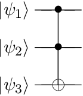
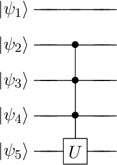

# QuantumInformation

[](https://travis-ci.org/goropikari/QuantumInformation.jl)

[](https://coveralls.io/github/goropikari/QuantumInformation.jl?branch=master)

[](http://codecov.io/github/goropikari/QuantumInformation.jl?branch=master)

This is unofficial extension of [QuantumOptics.jl](https://github.com/qojulia/QuantumOptics.jl).  
Add some quantum gates.

By default, `QuantumOptics.set_printing(standard_order=true)`.  
ref: [QuantumOptics.jl documentation - Operator data and tensor products](https://qojulia.org/documentation/quantumobjects/operators.html#tensor_order-1)

# Installation
```julia
Pkg.clone("https://github.com/goropikari/QuantumInformation.jl")
```

# Usage
Supported single qubit gates are following.


## Pauli matrix
```julia
julia> sigmax()
SparseOperator(dim=2x2)
  basis: Spin(1/2)
  [2, 1]  =  1.0+0.0im
  [1, 2]  =  1.0+0.0im

julia> sigmay()
SparseOperator(dim=2x2)
  basis: Spin(1/2)
  [2, 1]  =  0.0+1.0im
  [1, 2]  =  0.0-1.0im

julia> sigmaz()
SparseOperator(dim=2x2)
  basis: Spin(1/2)
  [1, 1]  =  1.0+0.0im
  [2, 2]  =  -1.0+0.0im

julia> sigmam()
SparseOperator(dim=2x2)
  basis: Spin(1/2)
  [2, 1]  =  1.0+0.0im

julia> sigmap()
SparseOperator(dim=2x2)
  basis: Spin(1/2)
  [1, 2]  =  1.0+0.0im
```

## Hadamard
```julia
julia> hadamard()
DenseOperator(dim=2x2)
  basis: Spin(1/2)
 0.707107+0.0im   0.707107+0.0im
 0.707107+0.0im  -0.707107+0.0im

julia> hadamard(2) # equivalent to hadamard() ⊗ hadamard()
DenseOperator(dim=4x4)
  basis: [Spin(1/2) ⊗ Spin(1/2)]
 0.5+0.0im   0.5+0.0im   0.5+0.0im   0.5+0.0im
 0.5+0.0im  -0.5+0.0im   0.5+0.0im  -0.5+0.0im
 0.5+0.0im   0.5+0.0im  -0.5+0.0im  -0.5+0.0im
 0.5+0.0im  -0.5+0.0im  -0.5+0.0im   0.5-0.0im
```

## S gate
```julia
 julia> sgate()
SparseOperator(dim=2x2)
  basis: Spin(1/2)
  [1, 1]  =  1.0+0.0im
  [2, 2]  =  0.0+1.0im

julia> sdggate()
SparseOperator(dim=2x2)
  basis: Spin(1/2)
  [1, 1]  =  1.0+0.0im
  [2, 2]  =  0.0-1.0im
```

## T gate
```julia
julia> tgate()
SparseOperator(dim=2x2)
  basis: Spin(1/2)
  [1, 1]  =  1.0+0.0im
  [2, 2]  =  0.707107+0.707107im

julia> tdggate()
SparseOperator(dim=2x2)
  basis: Spin(1/2)
  [1, 1]  =  1.0+0.0im
  [2, 2]  =  0.707107-0.707107im
```

## Phase shift
```julia
julia> phaseshift(π/3)
SparseOperator(dim=2x2)
  basis: Spin(1/2)
  [1, 1]  =  1.0+0.0im
  [2, 2]  =  0.5+0.866025im
```

## CNOT gate
```julia
julia> cnot()
SparseOperator(dim=4x4)
  basis: [Spin(1/2) ⊗ Spin(1/2)]
  [1, 1]  =  1.0+0.0im
  [2, 2]  =  1.0+0.0im
  [4, 3]  =  1.0+0.0im
  [3, 4]  =  1.0+0.0im

julia> cnot(3, 2, 3) # equivalent to identityoperator(SpinBasis(1//2)) ⊗ cnot()
SparseOperator(dim=8x8)
  basis: [Spin(1/2) ⊗ Spin(1/2) ⊗ Spin(1/2)]
  [1, 1]  =  1.0+0.0im
  [2, 2]  =  1.0+0.0im
  [4, 3]  =  1.0+0.0im
  [3, 4]  =  1.0+0.0im
  [5, 5]  =  1.0+0.0im
  [6, 6]  =  1.0+0.0im
  [8, 7]  =  1.0+0.0im
  [7, 8]  =  1.0+0.0im
```


## Toffoli gate

```julia
julia> toffoli()
SparseOperator(dim=8x8)
  basis: [Spin(1/2) ⊗ Spin(1/2) ⊗ Spin(1/2)]
  [1, 1]  =  1.0+0.0im
  [2, 2]  =  1.0+0.0im
  [3, 3]  =  1.0+0.0im
  [4, 4]  =  1.0+0.0im
  [5, 5]  =  1.0+0.0im
  [6, 6]  =  1.0+0.0im
  [8, 7]  =  1.0+0.0im
  [7, 8]  =  1.0+0.0im

julia> nqubits = 4;
julia> controls = [1, 2];
julia> target = 3
julia> toffoli(nqubits, controls, target)
SparseOperator(dim=16x16)
  basis: [Spin(1/2) ⊗ Spin(1/2) ⊗ Spin(1/2) ⊗ Spin(1/2)]
  [1 ,  1]  =  1.0+0.0im
  [2 ,  2]  =  1.0+0.0im
  [3 ,  3]  =  1.0+0.0im
  [4 ,  4]  =  1.0+0.0im
  [5 ,  5]  =  1.0+0.0im
  [6 ,  6]  =  1.0+0.0im
  [7 ,  7]  =  1.0+0.0im
  [8 ,  8]  =  1.0+0.0im
  [9 ,  9]  =  1.0+0.0im
  [10, 10]  =  1.0+0.0im
  [11, 11]  =  1.0+0.0im
  [12, 12]  =  1.0+0.0im
  [15, 13]  =  1.0+0.0im
  [16, 14]  =  1.0+0.0im
  [13, 15]  =  1.0+0.0im
  [14, 16]  =  1.0+0.0im
```

## multi-controlled gate

```julia
julia> nqubits = 5;
julia> controls = [2, 3, 4];
julia> target = 5;
julia> op = sigmax();
julia> controlsgate(nqubits, controls, target, op)
SparseOperator(dim=32x32)
  basis: [Spin(1/2) ⊗ Spin(1/2) ⊗ Spin(1/2) ⊗ Spin(1/2) ⊗ Spin(1/2)]
  [1 ,  1]  =  1.0+0.0im
  [2 ,  2]  =  1.0+0.0im
  [3 ,  3]  =  1.0+0.0im
  [4 ,  4]  =  1.0+0.0im
  [5 ,  5]  =  1.0+0.0im
  [6 ,  6]  =  1.0+0.0im
  [7 ,  7]  =  1.0+0.0im
  [8 ,  8]  =  1.0+0.0im
  [9 ,  9]  =  1.0+0.0im
  [10, 10]  =  1.0+0.0im
  [11, 11]  =  1.0+0.0im
  [12, 12]  =  1.0+0.0im
  [13, 13]  =  1.0+0.0im
  [14, 14]  =  1.0+0.0im
  [16, 15]  =  1.0+0.0im
  [15, 16]  =  1.0+0.0im
  [17, 17]  =  1.0+0.0im
  [18, 18]  =  1.0+0.0im
  [19, 19]  =  1.0+0.0im
  [20, 20]  =  1.0+0.0im
  [21, 21]  =  1.0+0.0im
  [22, 22]  =  1.0+0.0im
  [23, 23]  =  1.0+0.0im
  [24, 24]  =  1.0+0.0im
  [25, 25]  =  1.0+0.0im
  [26, 26]  =  1.0+0.0im
  [27, 27]  =  1.0+0.0im
  [28, 28]  =  1.0+0.0im
  [29, 29]  =  1.0+0.0im
  [30, 30]  =  1.0+0.0im
  [32, 31]  =  1.0+0.0im
  [31, 32]  =  1.0+0.0im
```
